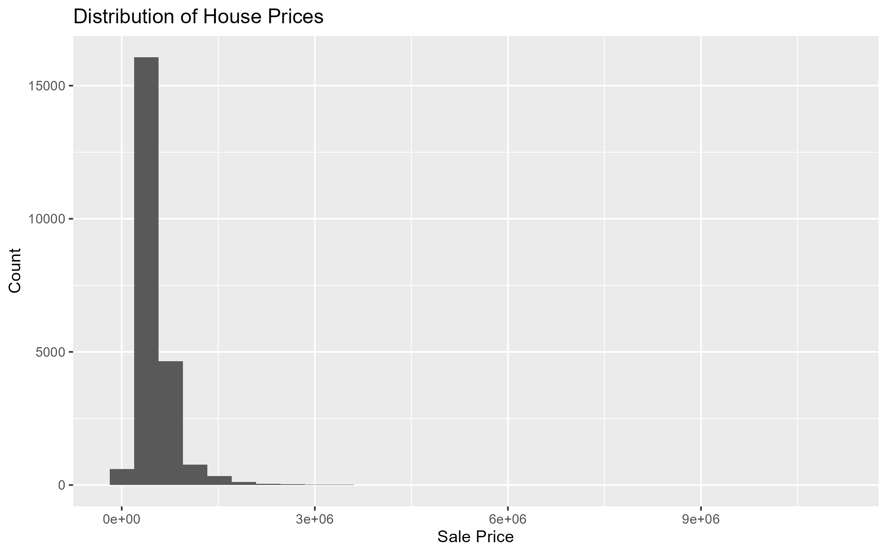
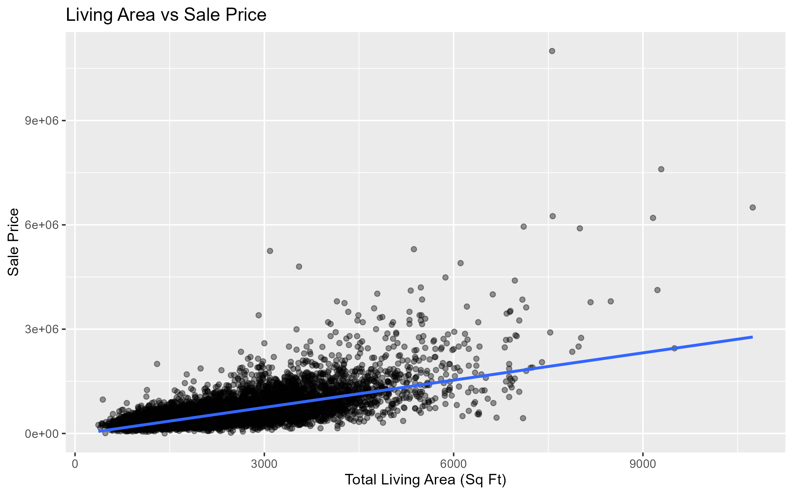

# House Price Analysis and Prediction in R

## Overview
This project analyzes residential housing data in R to identify the factors that most influence home prices and to build a regression model for price prediction.

## Business Problem
Accurate house price estimation helps buyers, sellers, investors, and analysts make better real estate decisions. The goal of this project is to explore the drivers of housing value and build an interpretable predictive model.

## Skills Demonstrated
- R programming
- Data cleaning and preprocessing
- Exploratory data analysis (EDA)
- Data visualization with ggplot2
- Regression modeling
- Model evaluation using RMSE, MAE, and R-squared
- Business-focused interpretation of results

## Recommended Dataset
A housing dataset such as the King County House Sales dataset.

Expected file location:
`data/house_sales.csv`

## Project Structure
```text
house-price-r-project/
│── data/
│   └── house_sales.csv
│── scripts/
│   ├── 01_setup_packages.R
│   ├── 02_data_cleaning.R
│   ├── 03_eda.R
│   ├── 04_modeling.R
│   └── 05_run_all.R
│── images/
│── output/
│── README.md
```

## How to Run
1. Place your dataset in `data/house_sales.csv`
2. Open the project in RStudio
3. Run:
```r
source("scripts/05_run_all.R")
```

## Expected Outputs
The project will generate:
- Cleaned dataset summary
- Descriptive statistics
- Visualizations in the `images/` folder
- Model evaluation metrics in `output/model_metrics.txt`

## Model Performance

The regression model achieved strong predictive performance:

- RMSE: $126,648
- MAE: $63,564
- R-squared: 0.8728

The model explains approximately 87% of the variance in housing prices, indicating a high level of accuracy. The relatively low MAE suggests that predictions are reasonably close to actual values.

## Key Insights

- Total living area (SqFtTotLiving) is one of the strongest predictors of price
- Building grade significantly impacts property value
- Structural features such as bathrooms and lot size contribute to pricing
- The model demonstrates that housing prices can be effectively modeled using linear regression with key features


## Future Improvements
- Compare linear regression with random forest or boosted models in R
- Add feature engineering for house age and renovation effects
- Build an R Markdown report or Shiny dashboard
- Test regularization methods such as Ridge or Lasso


## Visualizations


